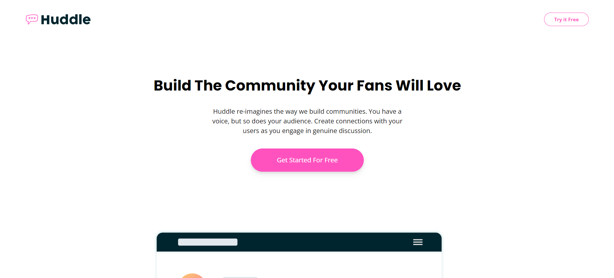
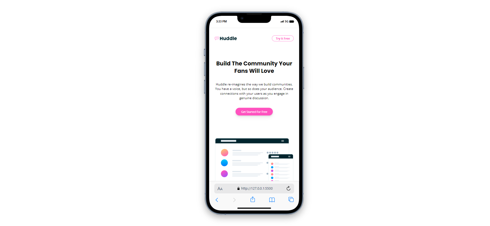

# Frontend Mentor - Huddle landing page

This is a solution to the [Huddle landing page with curved sections challenge on Frontend Mentor](https://www.frontendmentor.io/challenges/huddle-landing-page-with-curved-sections-5ca5ecd01e82137ec91a50f2). Frontend Mentor challenges help you improve your coding skills by building realistic projects.

## Table of contents

- [Overview](#overview)
  - [The challenge](#the-challenge)
  - [Screenshot](#screenshot)
  - [Links](#links)
- [My process](#my-process)
  - [Built with](#built-with)
  - [What I learned](#what-i-learned)
- [Author](#author)

## Overview

## The challenge

Users should be able to:

- View the optimal layout for the site depending on their device's screen size
- See hover states for all interactive elements on the page

### Screenshot




### Links

- Solution URL: [FrontendMentor](https://www.frontendmentor.io/profile/mirfanwebdev)
- Live Site URL: [Github Page](https://mirfanwebdev.github.io/frontendmentor-huddle-landingpage/)

## My process

### Built with

- Semantic HTML5 markup
- Flexbox
- Mobile-first workflow
- Tailwind CSS

## What I learned

I learned css framework implementation with tailwind css. Made responsive website using tailwind breakpoint. I used custom color and font-family with adding colors and fontfamily object in tailwind.config.js

```js
module.exports = {
  content: ["index.html"],
  theme: {
    extend: {
      colors: {
        pink: "hsl(322, 100%, 66%)",
        lightPink: "hsl(321,100%,78%)",
        lightRed: "hsl(0,100%,63%)",
        darkCyan: "hsl(192,100%,9%)",
        paleBlue: "hsl(207,100%,98%)",
      },
      fontFamily: {
        heading: ["Poppins", "sans-serif"],
        body: ['"Open Sans"'],
      },
    },
  },
  plugins: [],
};
```

I also learned to use picture html tag to render different curve decoration based on screen size

```html
<picture>
  <source media="(min-width: 768px)" srcset="your-desktop-size-assets" />
  
</picture>
```

## Author

- Website - [M. Irfan](https://mirfandev.tech)
- Frontend Mentor - [@mirfanwebdev](https://www.frontendmentor.io/profile/mirfanwebdev)
- Twitter - [@mirfanwebdev](https://https://twitter.com/mirfanwebdev)
